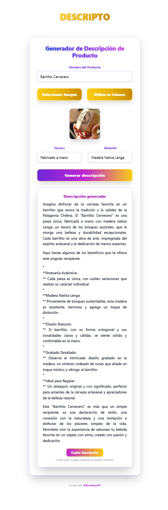

<div align="center">
  
  <h1>📝 Descripto</h1>
  <p><b>Genera descripciones irresistibles para productos artesanales con IA</b></p>
  <p>
    
    
    
    
  </p>
</div>

---

## 🚀 ¿Qué es Descripto?

Descripto es una app web que te ayuda a crear descripciones profesionales y persuasivas para productos artesanales, usando inteligencia artificial de Google Gemini. Solo sube una foto, completa los datos y obtén un texto listo para vender en segundos.

---

## ✨ Características

- Genera descripciones detalladas y atractivas para productos artesanales
- Analiza la imagen del producto para sumar detalles visuales
- Copia la descripción con un clic
- Interfaz moderna, responsiva y fácil de usar

---

## 🖥️ Capturas de pantalla

<div align="center">
  
</div>

---

## ⚡ Tecnologías

- React 19
- Vite 7
- TailwindCSS 3
- Google Gemini AI API

---

## 🛠️ Instalación y uso

1. Clona el repositorio
2. Instala dependencias:
   ```bash
   npm install
   ```
3. Inicia el servidor de desarrollo:
   ```bash
   npm run dev
   ```
4. Abre [http://localhost:5173](http://localhost:5173) en tu navegador

---

## 👨‍💻 Autor

Creado por [@DonGeeo87](https://github.com/DonGeeo87)

---

<p align="center">¡Con Descripto, vender es más fácil! 🚀</p>
